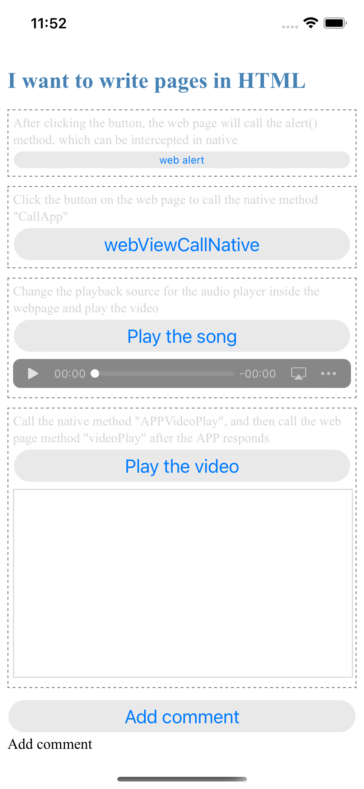

## The interaction process between WKWebView and JS

OC and Swift two versions, the principle is relatively simple, the UI is as follows:



### OC, Swift call JS method

JS prepares a method

```
// Method waiting for native call
function videoPlay(videoUrl){
    var video = document.getElementById('id-my-video')
    video.setAttribute("src", videoUrl)
    video.play()
}
```

native to call `videoPlay(videoUrl)`

**OC:** 

```
NSString* url = @"http://muymov.a.yximgs.com/bs2/newWatermark/MTQwMjI4MjU2NDM_zh_4.mp4";

//  must have double quotes
NSString* method = [NSString stringWithFormat:@"videoPlay(\"%@\")", url];
[self.webView evaluateJavaScript:method completionHandler:^(id _Nullable obj, NSError * _Nullable error) {
    if (error) {
        NSLog(@"%@", error);
    }else{
        NSLog(@"JS method call succeeded");
    }
}];
```

**Swift:**

```
let url = "http://muymov.a.yximgs.com/bs2/newWatermark/MTQwMjI4MjU2NDM_zh_4.mp4"
      
//  must have double 
let method = "videoPlay(\"\(url)\")"
webView.evaluateJavaScript(method) { (obj, error) in
    if let myError = error {
        print(myError)
    }else{
        print("JS methed call succeeded")
    }
}       
```

### JS calls OC and Swift methods

For example, JS needs to call the native `CallApp` method, then write it as follows in the place where it needs to be called.

```
var params = {'url': 'Call APP method "CallApp()"'}
window.webkit.messageHandlers.CallApp.postMessage(params);
```

Initialize `WKWebView` as follows, call the `addScriptMessageHandler: name` method, and register the `CallApp` method，as follows：

**OC:**

```
-(WKWebView *)webView{
    if (!_webView) {
        WKWebViewConfiguration* config = [[WKWebViewConfiguration alloc] init];
        config.allowsInlineMediaPlayback = YES;//可以禁止弹出全屏  网页video标签要加 上playsinline 这个属性
        WKUserContentController* uc = [[WKUserContentController alloc] init];
        config.userContentController = uc;
        [uc addScriptMessageHandler:self name:@"CallApp"];
        [uc addScriptMessageHandler:self name:@"APPVideoPlay"];
        //        其中name参数在JS里的写法如下：
        //        window.webkit.messageHandlers.CallApp.postMessage(params);
        //        就是 messageHandlers 后面的参数
        
        _webView = [[WKWebView alloc] initWithFrame:CGRectZero configuration:config];
        _webView.UIDelegate = self;
    }
    
    return _webView;
}
```

**Swift:**

```
lazy var webView : WKWebView = {
    let config = WKWebViewConfiguration()
    config.allowsInlineMediaPlayback = true //可以禁止弹出全屏  网页video标签要加上 playsinline 这个属性
    let uc = WKUserContentController()
    config.userContentController = uc
    uc.add(self, name: "CallApp")
    uc.add(self, name: "APPVideoPlay")
    //        其中name参数在JS里的写法如下：
    //        window.webkit.messageHandlers.CallApp.postMessage(params);
    //        就是 messageHandlers 后面的参数
        
    let web = WKWebView(frame: .zero, configuration: config)
    //        webView.frame = view.bounds
    web.uiDelegate = self;
    return web
}()
```

You can get the response in the UIDelegate prosy of webview.

**OC:**

```
#pragma mark - WKScriptMessageHandler
- (void)userContentController:(WKUserContentController *)userContentController didReceiveScriptMessage:(WKScriptMessage *)message{
    
    NSLog(@"method name：%@", message.name);
    NSLog(@"parameter：%@", message.body);
}
```

**Swift:**

```
//    MARK:WKScriptMessageHandler
func userContentController(_ userContentController: WKUserContentController, didReceive message: WKScriptMessage) {
        
    print("method name：" + message.name)
    print("parameter：\(message.body)")
}
```


